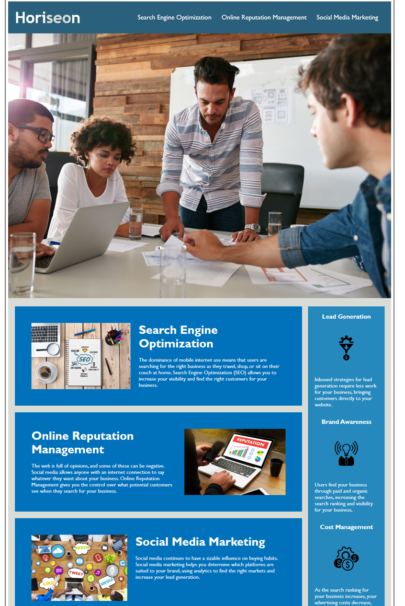

# HTML CSS Git Challenge: Code Refactor

## Description

In this project there was alot of bugs that needed to be fixed.

By fixing the HTML structure to its correct way, it helped the website not crash. 

Mainly in the body section and needed to added some CSS to fixed misplace items.

## Installation

VS Code 

Git Bash 

## Usage

AS A marketing agency
I WANT a codebase that follows accessibility standards
SO THAT our own site is optimized for search engines

## License

🏆

